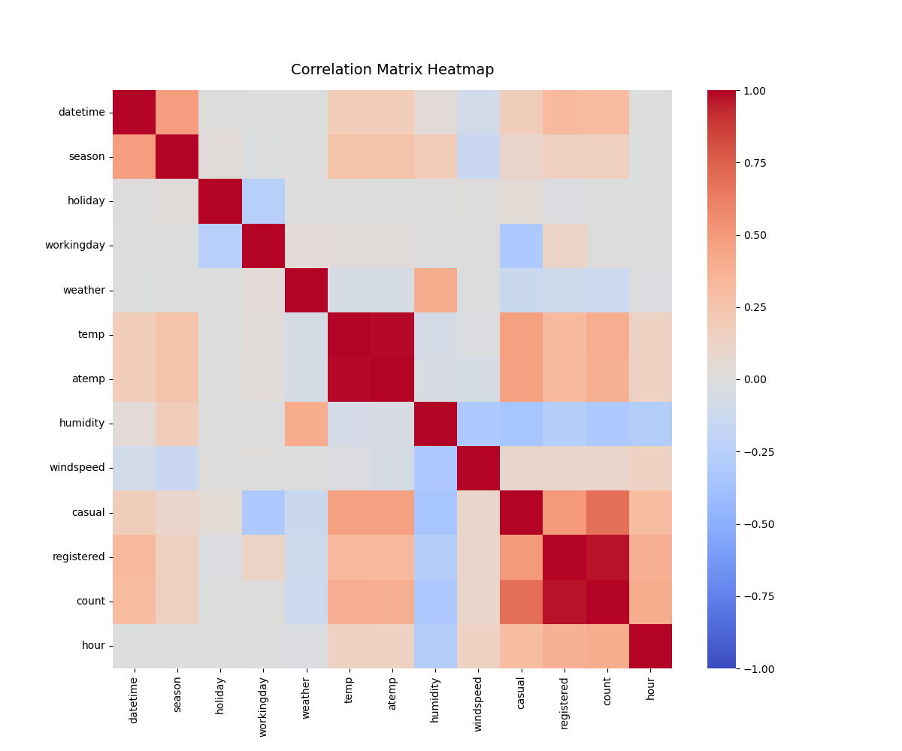
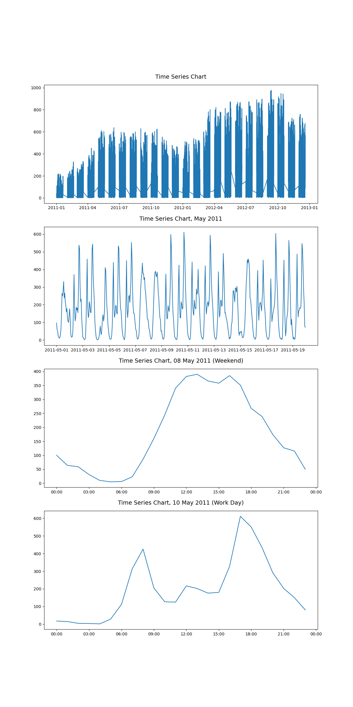
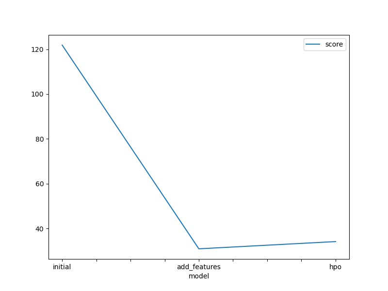
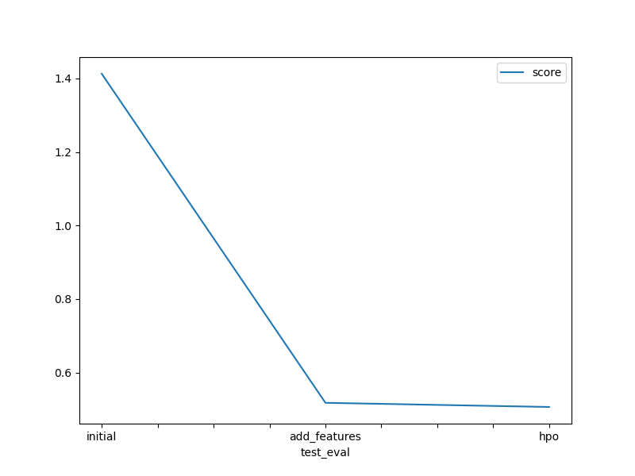
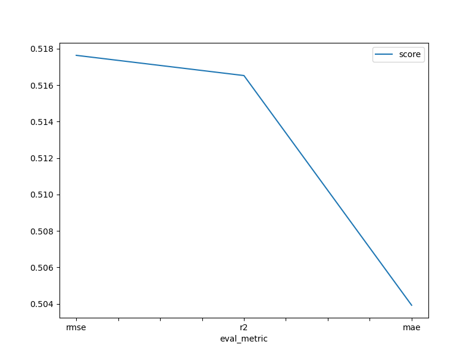
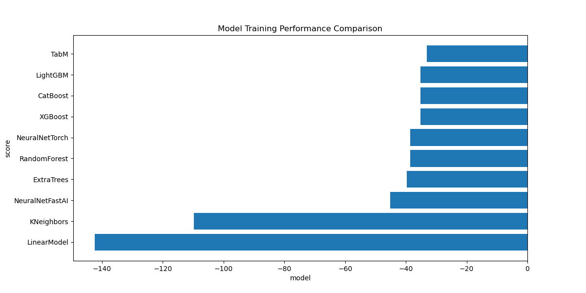

# Report: Predict Bike Sharing Demand with AutoGluon Solution
#### MICHAEL MATELA

## Initial Training
### What did you realize when you tried to submit your predictions? What changes were needed to the output of the predictor to submit your results?
Before submitting the predictions, all negative predictions had to be set to zero because kaggle could not accept negative values for `count`, which made practical sense since count cannot be negative.

### What was the top ranked model that performed?
The top ranked model was `WeightedEnsemble_L2`.

## Exploratory data analysis and feature creation
### What did the exploratory analysis find and how did you add additional features?
The exploratory data analysis found the distribution of data for each feature. This was achieved by generating a histogram for each feature. Through the `train.describe()` command, the findings below were made:
- datetime - demand was generally equally distributed across the different dates.
- season - demand was very consistent across all seasons, with slightly lower demand in Spring than in other seasons. 
- holiday - the demand was almost entirely on non-holiday days. This is in most likelihood because there are only a few holidays in a year.
- workingday - approximately 60% of the demand was on working days. In a five-day working week, this means that the demand, per day, on weekends is significantly higher on weekends and holidays than on working days.
- weather - highest demand was experienced on clear/partly cloudy days, followed by misty days with some clouds, and the lowest demand recorded on days with heavy precipitation.
- temp - demand was approximately evenly distributed during temperatures ranging from 10 degrees celsius to 30 degrees celsius with significantly lower demand outside this range.
- humidity - reasonable demand was experienced across all levels of humidity above 30% with the highest demand recorded for humidity ranging from 40% to 90%.
- windspeed - demand showed a significantly high preference for low wind speeds.
- casual - only a small number of non-registered user rentals were initiated.
- registered - no registered user rentals were initiated on most days, however, there was significantly more registered user rentals were initiated compared to non-registered user rentals.

_Correlation Matrix_

The figure below shows the correlation between different features in the dataset. An extremely high correlation was found between `registered` and `count`. A possible explanation is that the feature `registered` was derived from `count`, that is, `registered` was only known after a bike ride was booked, meaning that `registered` was not input data to the bike sharing demand. The same argument applies for `casual`. Features with an extremely high correlation to the target value signal data leakage and, therefore, another reason why it was necessary to remove them from the dataset before model training.
The rest of the correlations were between -0.5 and 0.5 and did not raise any concerns.

_Time Series_

Four time series graphs were plotted - one for the entire dataset, one for a one month period, one for weekend day, and, lastly, one for a working day. The plots are shown below.

From the plots above, the following findings are made:
- The bike sharing demand is seasonal with higher demands recorded in summer months compared to winter months. The general trend also indicates that the demand was increasing over time.
- The month of May was selected to study the bike sharing demand over a typical one month period. The demand was generally flat throughout the month with relatively higher demands recorded on working days compared to weekends.
- On weekends, peak demands were recorded in the afternoons whereas demand peaked during morning and evening rush hours on working days. A much smaller peak was also observed around lunchtime on a working day.

### How much better did your model preform after adding additional features and why do you think that is?
The model perfomed significantly better after the addidtion of the `hour` feature, increasing the best model's score_val from `-121.8` to `-30.9`. The kaggle score also showed significant improvement, moving from `1.41288` to `0.51764`. Further features were added, namely:

- `rush_hour` - categorized morning (7-9am), lunch (11am-1pm), and evening (4-8pm) rush hours
- `temp_class` - categorized temperature into hot (`temp` > 25), cold (`temp` < 10), and mild (10 <= `temp` <= 25)
- `wind_class` - categorized windspeed into very windy (`windspeed` > 25) and mild wind (`windspeed` <= 25)
- `humid_class` - categorized humidity into very humid (`humidity` > 50) and not humid (`humidity` <= 50)

Addition of these new features further improved the predictions, improving the kaggle score from `0.51764` to `0.50205` and the top model score decreased from `-30.9` to `-32.6` . Adding new features reduced the bias in the model, and therefore, improving the predictions. The poorer top model score may, perhaps, mean that slight overfitting was detected which causes the models to perform better on the training data but give poorer predictions on the test data.

## Hyper parameter tuning
### How much better did your model preform after trying different hyper parameters?
The model showed only a slight improvement in performance after hyperparameter tuning. An improved kaggle score of `0.50629` was achieved from the `0.51764` achieved after adding an additional feature. A minuteness of the improvement can be attributed to the following:

- Autogluon hyperparameters are already very well optimised and, therefore, it is very difficult to beat the performance of the models by manually tuning the hyperparameters.
- Tuning the hyperparameters manually limits them to specific values and also, autogluon is limited to only the models that are listed. Autogluon utilises many models and many hyperparameters and only selecting a few models, and tuning a few hyperparameters, constraints autogluon from performing to its fullest capability.

### If you were given more time with this dataset, where do you think you would spend more time?
Addition of the first new feature to the dataset drastically improved the predictions and, therefore, it would likely be worthwile to spend more time feature engineering to discover more new features that can greatly improve the predictions. As explained above, manual hyperparameter tuning in AutoGluon is an intricate process that requires time, skill, and experience. Spending more time on determining the best hyperparameters can also help significantly improve the predictions.

### Create a table with the models you ran, the hyperparameters modified, and the kaggle score.
|model|hpo1|hpo2|hpo3|score|
|--|--|--|--|--|
|initial|100|31|0.1|1.41288|
|add_features|100|31|0.1|0.51764|
|hpo|3000|100|0.05|0.50629|

### Create a line plot showing the top model score for the three (or more) training runs during the project.

### Create a line plot showing the top kaggle score for the three (or more) prediction submissions during the project.

### Create a line plot showing the top kaggle score for the three prediction submissions for the three different metrics used.

### Individual algorithm performance comparison.
The best performing algorithm was the Tabular Deep Learning Model (TABM) which utilizes neural networks to produce predictions. Second was the the Gradient Boosting Machine algorithm (GBM) which is a tree ensemble where trees are built sequentially with each new tree improving the performance of the previous trees. GBM has an edge over Random Forest (RF) because RF builds trees in parallel meaning that the trees do not improve each others performances. The third best performing algorithm was the Categorical Boosting algorithm (CAT). CAT is known to be good with categorical datasets. The dataset contained categorical features, namely, weather and season, and categorising these two features helps an algorithm like CAT to perform better on the dataset.

The worst performing algorithm was the Linear Regression (LR) algorithm and the K-Nearest Neighbors (KNN) was the second worst. The very poor perfomance by the LR is an indication that the data points are non-linear and therefore create a high bias in the LR algorithm. KNN is a classification algorithm and therefore it is expected to perform poorly on a regression problem.

The figure below shows the visual comparison of the models, where the high negative scores indicate the worst performing algorithms and the low negative scores (closer to zero) indicate the best perfoming models.

## Summary
The purpose of this project was to use the AutoGluon library to train several machine learning models for the Bike Sharing Demand project on kaggle. AutoGluon is an AutoML framework and its strength is in its ability to train and ensemble multiple models in order to produce high-accuracy predictions.

The first step was to input raw data into the AutoGluon TablePredictor with default parameters and to output a set of initial predictions. The best-ranked model was the `WeightedEnsemble_L2` and, therefore, this was the model that AutoGluon used to produce predictions. Before submitting the predictions on kaggle for scoring, it was necessary to set the negative values to zero because `count` cannot be negative. The kaggle score was the retrieved to check how the model performed.

Several refinements, such as feature engineering, hyperparameter tuning and change in the evaluation metric, were performed in an attempt to improve the quality of the predictions, and the following findings were made:
- adding a new `month` feature greatly improved performance.
- manual modification of the hyperparameters only slighly improved model performances, testament to how well optimised AutoGluon hyperparameters are, and also, the high level of skill that is required to improve, or beat, its performance through manual hyperparameter tuning.
- changing the evaluation metric only slightly altered the model performances. 